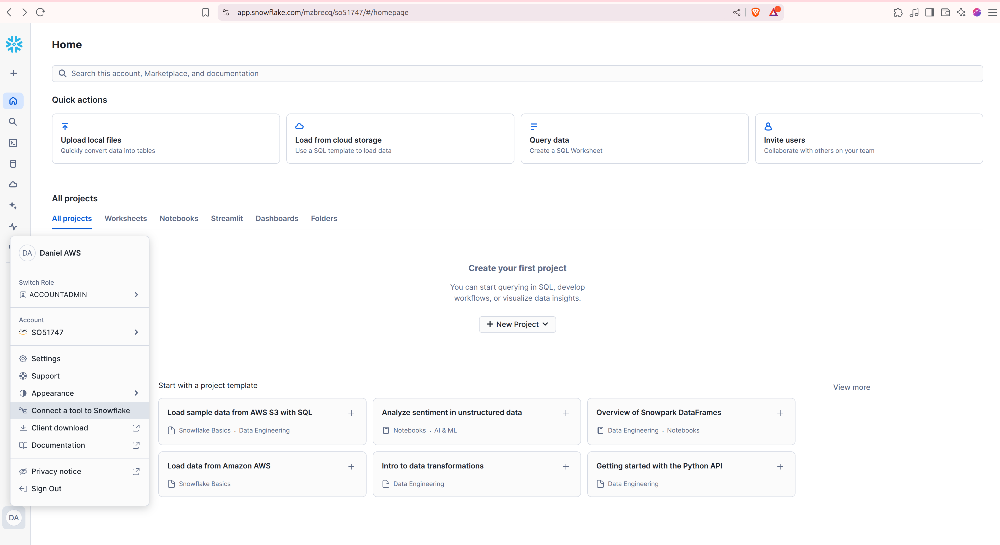
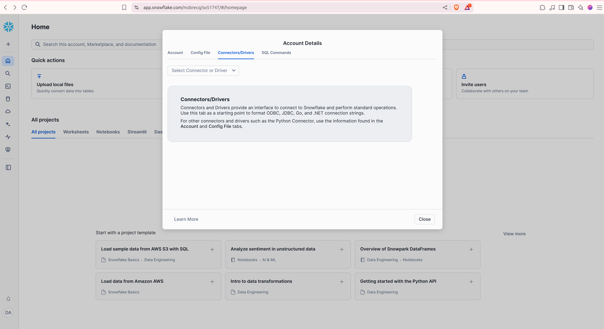
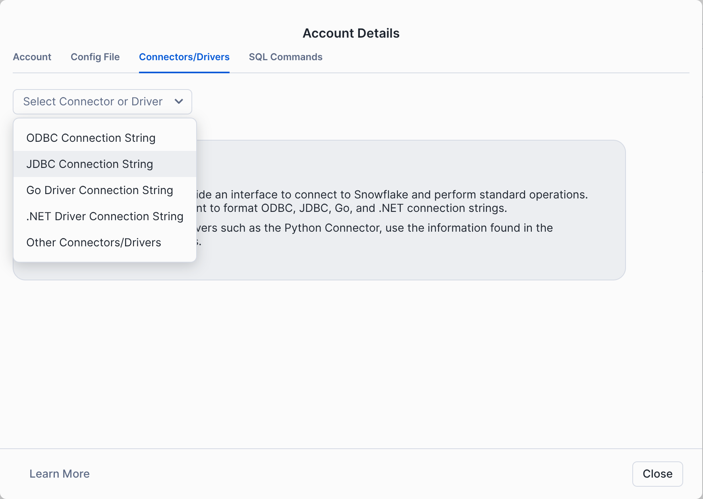
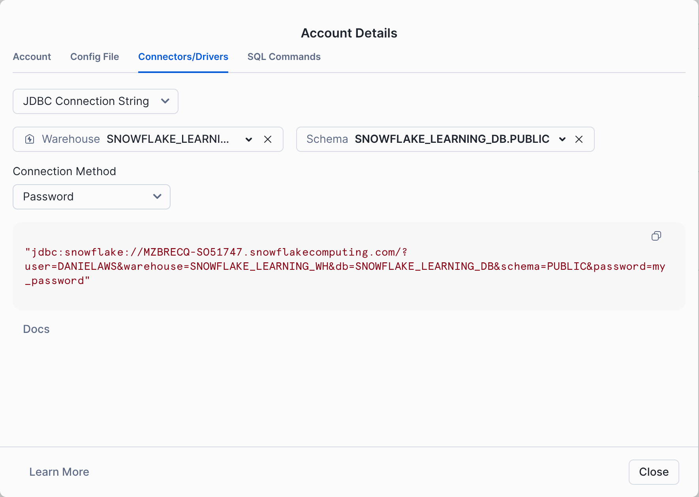

# What this application does ?
Connects to snowflake database, automatically creates 3 tables (using liquibase), inserts data
and exposes endpoints through swagger to execute CRUD operations for User entity

## Tech stack
- Java 21
- Maven 3.x.x

## Getting snowflake connection credentials (for application.yml)

Authenticate with you snowflake account and go to home page.

Click on account icon in bottom left corner :



Click on tab Connectors/Drivers :



Select JDBC connection string :



Select the Warehouse, Schema and Connection Method select Password :



## Building and Running the Application

### Packaging the Application

To package the application into a JAR file, run:

```shell
./mvnw clean package
```

### Running the Application

#### As a Standalone JAR

```shell
java \
  -Dsnowflake.password=YOUR_PASSWORD \
  -Dsnowflake.username=YOUR_USERNAME \
  -Dsnowflake.account-identifier=YOUR_ACCOUNT_ID \
  -Dsnowflake.warehouse=YOUR_WAREHOUSE \
  -Dsnowflake.db=YOUR_DB \
  -Dsnowflake.schema=YOUR_SCHEMA \
  -jar target/snowflake-java-0.0.1-SNAPSHOT.jar
```

#### Using Spring Boot (Development Mode)

For local development, run the application directly using Spring Boot:

```shell
./mvnw spring-boot:run \
-Dspring-boot.run.arguments="\
--snowflake.password=YOUR_PASSWORD \
--snowflake.username=YOUR_USERNAME \
--snowflake.account-identifier=YOUR_ACCOUNT_ID \
--snowflake.warehouse=YOUR_WAREHOUSE \
--snowflake.db=YOUR_DB \
--snowflake.schema=YOUR_SCHEMA"
```

## Swagger link :

http://localhost:8080/swagger-ui/index.html


##  Useful links

Liquibase snowflake documentation :

https://docs.liquibase.com/start/tutorials/snowflake/snowflake.html#xml_example

JDBC connection documentation :

https://docs.snowflake.com/developer-guide/jdbc/jdbc-configure

https://docs.snowflake.com/user-guide/gen-conn-config#label-client-config-settings-snowsight